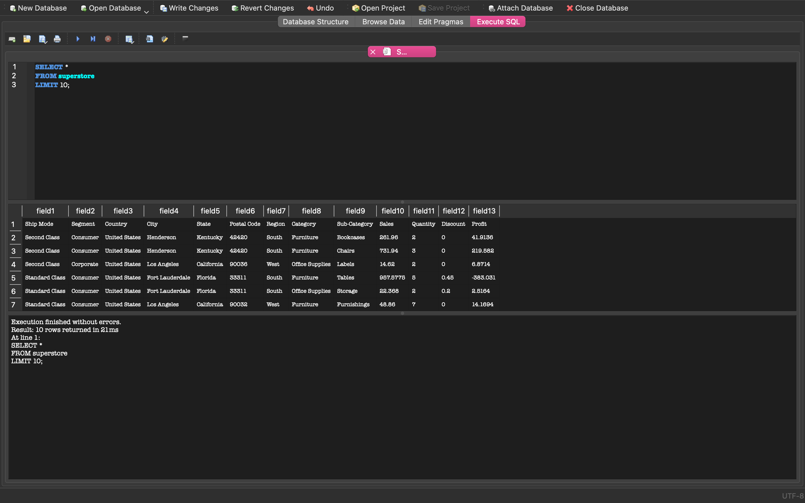
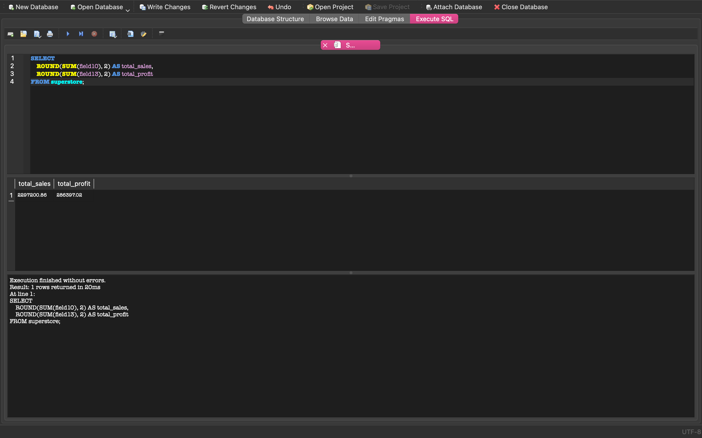
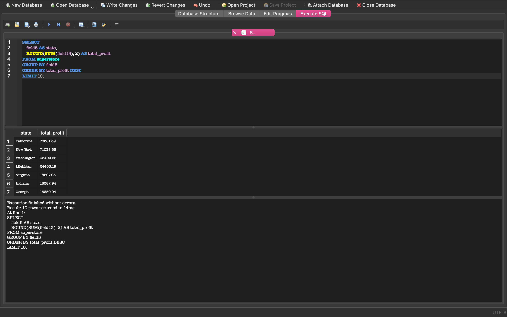
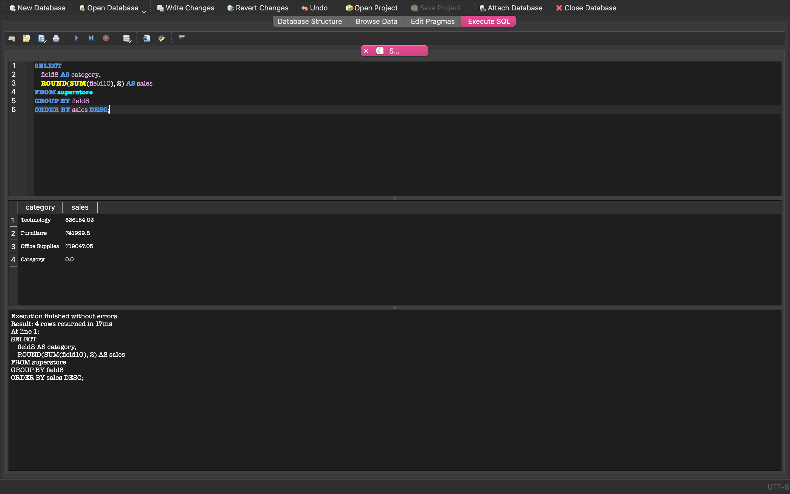
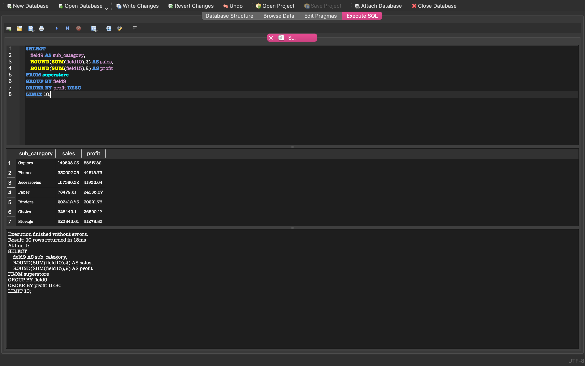
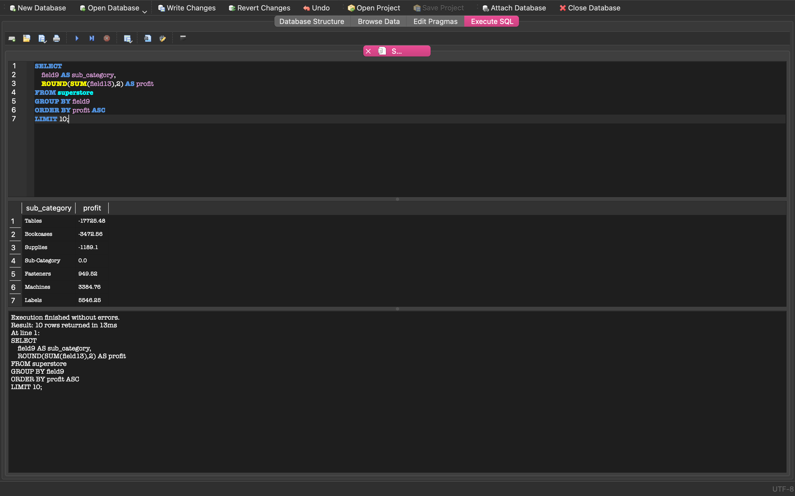

# Sales Performance Analysis Using SQL

## Project Overview

This project analyzes a retail sales dataset using SQL. The goal was to identify top-performing states, categories, and sub-categories based on sales and profit metrics.

## Tools Used

- SQL
- SQLite
- DB Browser for SQLite
- GitHub

## Dataset Structure

The dataset contains information about:

- Orders
- States
- Categories
- Sub-Categories
- Sales
- Profit
- Discounts

## Key Business Questions

1. What are the total sales and total profit?
2. Which states generate the highest sales?
3. Which states generate the highest profit?
4. Which product categories generate the most revenue?
5. Which sub-categories are the most profitable?
6. Which sub-categories generate losses?

## SQL Queries Included

- Total Sales and Profit
- Top 10 States by Sales
- Top 10 States by Profit
- Sales by Category
- Most Profitable Sub-Categories
- Least Profitable Sub-Categories

All SQL queries can be found in:

`queries.sql`

---

## Dataset Preview

---

## Total Sales and Profit

**Total Sales:** $2,297,200.86

**Total Profit:** $286,397.02

---

## Top States by Sales

Key finding: California generated the highest sales.

---

## Top States by Profit

Key finding: California and New York generated the highest profits.

---

## Sales by Category

Key finding: Technology generated the highest revenue.

---

## Most Profitable Sub-Categories

Key finding: Copiers and Phones generated the highest profits.

---

## Least Profitable Sub-Categories

Key finding: Tables and Bookcases generated significant losses.

---

## Project Summary

This analysis demonstrates the use of SQL aggregation functions, grouping, sorting, and business-focused data analysis. The project identifies high-performing products and regions while highlighting areas with negative profitability.
